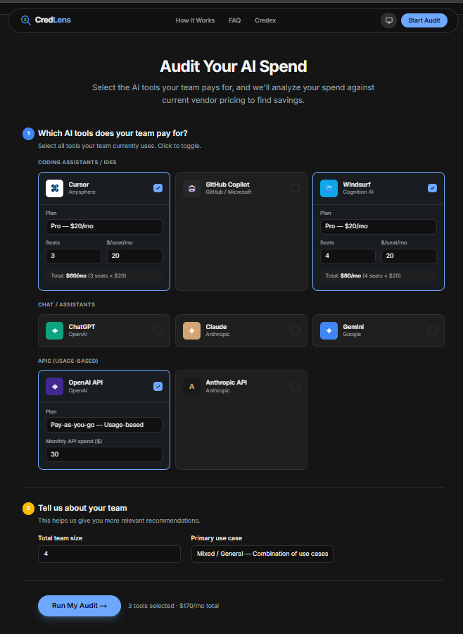
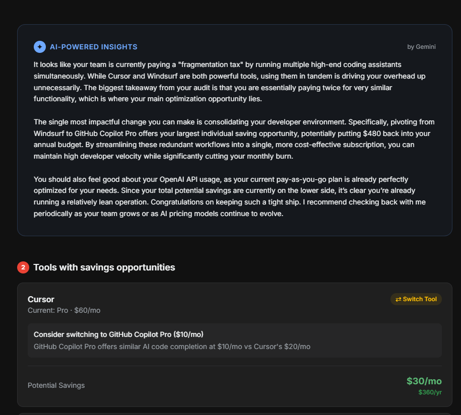

# CredLens 🔍

CredLens is a free AI spend audit tool for startup CTOs and ops leaders who want a fast, defensible view of wasted AI spend. Users input their tool stack and get instant savings recommendations, then unlock a shareable report after viewing the top-line savings.

Live demo: https://credlens.vercel.app/

## Screenshots / Demo
- Screenshot 1: Spend input form

- Screenshot 2: Results summary and tool-by-tool breakdown

- Screenshot 3: Share page

- Screenshot 4: Savings with Credex


 
## Core Features
- **Dynamic Rules Engine**: A hardcoded, highly tested algorithm that maps usage patterns to optimal pricing tiers across 8+ major AI vendors.
- **AI-Powered "CFO" Summaries**: Integrates with the Google Gemini (`gemini-3-flash-preview`) API to read the mathematical audit results and generate a conversational, actionable executive summary.
- **Lead Generation Pipeline**: Audits are "gated" behind a beautiful blur UI. Users must enter an email (verified through a honeypot anti-spam check) to unlock the full breakdown.
- **Transactional Emails**: Integrates with the Resend API to securely email users a permalink to their audit.
- **Sharable SSR Links**: Unique, persistent URLs (`/share/[id]`) loaded server-side from MongoDB, complete with dynamic OpenGraph tags for rich social media previews.

## Tech Stack
- **Framework:** Next.js 15 (App Router, Turbopack)
- **Language:** TypeScript
- **Styling:** Tailwind CSS v4 (Zero-config, vanilla aesthetics)
- **Database:** MongoDB Atlas (Mongoose ORM)
- **Email Delivery:** Resend API
- **Testing:** Vitest
- **CI/CD:** GitHub Actions & Vercel

## Getting Started

### Quick Start (Local)
1. **Clone the repository and install dependencies:**
   ```bash
   npm install
   ```

2. **Configure Environment Variables:**
   Create a `.env.local` file in the root directory:
   ```env
   MONGODB_URI="your_mongodb_connection_string"
   GEMINI_API_KEY="your_google_ai_key"
   RESEND_API_KEY="your_resend_api_key"
   NEXT_PUBLIC_BASE_URL="http://localhost:3000"
   ```

3. **Run the development server:**
   ```bash
   npm run dev
   ```
   Open [http://localhost:3000](http://localhost:3000) to view the application.

### Tests & Lint
```bash
npm run lint
npm run test
```

### Production Build
```bash
npm run build
npm run start
```

### Deploy (Vercel)
- Import the repo into Vercel
- Set `MONGODB_URI`, `GEMINI_API_KEY`, `RESEND_API_KEY`, and `NEXT_PUBLIC_BASE_URL` in Environment Variables
- Deploy

## Decisions (Trade-offs)
1. **Deterministic rules engine over AI for math**: AI only writes the summary; all savings are computed via code to keep numbers defensible.
2. **Soft gate vs hard gate**: We show total savings before email capture to build trust while still gating the detailed breakdown.
3. **Session storage for audit state**: Keeps URLs clean and avoids leaking private data in query params.
4. **SSR share page with MongoDB**: Enables OpenGraph previews and persistent public links with minimal backend complexity.
5. **Resend for transactional email**: Chosen for fast setup and high deliverability over heavier ESPs.

## Documentation
- [ARCHITECTURE.md](./ARCHITECTURE.md): Detailed explanation of data flow, state management, and the Gemini pipeline.
- [PROMPTS.md](./PROMPTS.md): The exact system prompts engineered for the Gemini API.
- [TESTS.md](./TESTS.md): Explanation of the Vitest framework and unit test scenarios.
- [DEVLOG.md](./DEVLOG.md): Daily development log chronicling the build process and technical decisions.
